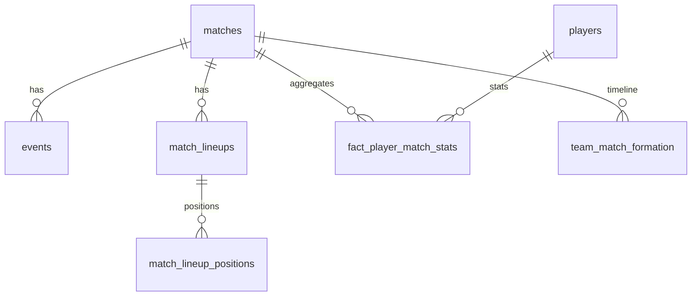

# Football Tactical Intelligence Platform — Agent Context

> Cursor 에이전트 **시스템 프롬프트**. 구현 전 필독. 불명확한 결정은 사용자에게 확인.  
> ERD 상세: `db/erd.dbml` | 데이터 검증: `scripts/validate_erd.py`

---

## 1. 프로젝트 정체성

**AI 기반 축구 전술 의사결정 플랫폼** (포트폴리오)

어필: 단순 CRUD가 아니라 **수집 → 저장/모델링 → 분석 → AI 추론**을 클라우드 위에서 end-to-end 구현.

```
수집 → S3(raw) → staging(silver) → analytics(gold) → 분석 → AI(RAG)
```

| 역량 | 어필 |
|------|------|
| DA | raw events → 경기×선수 팩트 집계, 인덱스 + `EXPLAIN ANALYZE` 전후 비교 |
| DE | 메달리온, 멱등·증분 적재, 실패 재처리, `ingestion_runs` |
| 클라우드 | EC2 PG → RDS 마이그레이션 비교, IAM/VPC/SG |
| AI | RAG + pgvector, **SQL 선계산 후 LLM** (순수 LLM 추천 금지) |

### 데모 시나리오 (이것만)
**다음 경기 상대 분석 → 우리 팀(South Korea) 라인업 추천**

- 우리 팀: **South Korea** (`team_id = 791`, WC 4경기)
- 분석 대상: **32개국 전체** (상대 전술 파악용)
- 시드: **2022 FIFA 월드컵** (`competition_id=43`, `season_id=106`, 64경기)
- 데이터: **StatsBomb Open Data만**

---

## 2. staging vs analytics (OLAP 관점)

| | staging (Silver) | analytics (Gold) |
|---|------------------|------------------|
| 역할 | StatsBomb **원천** 보존 | **집계·분석** 진입점 |
| 규모 | events **~235k행** | fact **~2k행** |
| 쿼리 | ETL 입력용 (분석 직접 스캔 X) | SUM/GROUP BY, 라인업 추천 SQL |
| 정규화 | 3NF + events `payload JSONB` | 팩트 테이블 (사전 집계) |

**집계 목적**: 수만 행 events → 경기×선수 팩트로 **~118배 축소** (실측 234,637 → 1,996행).

### 제거한 설계 (검증 후 확정)
| 제거 | 이유 |
|------|------|
| `oltp.*` | WC는 국가대회. 신체·시장가치 StatsBomb에 없음 → 합성 데이터는 약점 |
| `analytics.dim_*` | 팩트 ~2k행에 dim 4개는 과설계. `staging JOIN`으로 충분 |
| `dim_formation` FK | Tactical Shift 243건 — 팩트 FK로 시점 모호 → `team_match_formation` 타임라인으로 대체 |

---

## 3. 현재 단계 (Phase 1)

### 완료
- `explore_statsbomb.py`, Python venv, statsbombpy
- ERD 설계·단순화 (`db/erd.dbml`, 11테이블)
- **실데이터 검증** (`scripts/validate_erd.py`) — WC2022 64경기 전수

### 실측 규모 (검증 결과)
| 항목 | 값 |
|------|-----|
| 경기 | 64 |
| 팀 | 32 |
| events | 234,637 (경기당 ~3,666) |
| fact_player_match_stats | ~1,996 |
| formation 이벤트 | 371 (Starting XI 128 + Tactical Shift 243) |
| 한국 경기 | 4 (`3857287`, `3857299`, `3857262`, `3869253`) |

### 지금 할 일
1. PostgreSQL DDL (`staging` + `analytics`) — `db/schema/*.sql`
2. WC2022 인제스트 → `staging`
3. ETL → `fact_player_match_stats`, `team_match_formation`
4. 인덱스 + `EXPLAIN ANALYZE` 캡처 (`docs/performance/`)

### 이후 (Phase 2+)
| Phase | 내용 |
|-------|------|
| 2 | S3 bronze, Airflow/MWAA 또는 EventBridge+Lambda |
| 3 | AWS RDS PostgreSQL + pgvector |
| 4 | EC2 PG → RDS 비교 문서 |
| 5 | AI 라인업 (SQL + RAG + LLM) |

### 범위 제외
- 계약·부상·훈련, StatsBomb 외 소스, 웹 UI, 유료 API

---

## 4. 데이터 모델 (11테이블)

> 전체 ERD: `db/erd.dbml`

### staging (8)
| 테이블 | 역할 |
|--------|------|
| `competitions`, `seasons` | 대회·시즌. seasons PK = `(competition_id, season_id)` 복합 |
| `teams`, `players` | 32팀, ~800선수. lineups에서 upsert |
| `matches` | 64경기 메타. `stadium`→`stadium_name`, `referee`→`referee_name` |
| `events` | **~235k raw**. 공통 컬럼 + `payload JSONB` |
| `match_lineups` | 경기 스쿼드·선발 여부 |
| `match_lineup_positions` | 포지션·교체 **시간 구간** → minutes 집계 |
| `ingestion_runs` | 배치 멱등·재처리 추적 |

### analytics (3)
| 테이블 | 역할 |
|--------|------|
| **`fact_player_match_stats`** ★ | grain: `(match_id, player_id)`. 분석·SQL 컨텍스트 진입점 |
| **`team_match_formation`** | `(match_id, team_id, from_minute)` 포메이션 타임라인 |
| `embedding_documents` | RAG 벡터 (Phase 5) |

### ER (핵심)



### fact_player_match_stats 컬럼
출전(minutes, is_starter, position) · 패스 · 슈팅(xG, goals, assists) · 수비(pressures, interceptions, blocks) · dribbles · cards

FK는 **staging 원천 ID 직접 참조** (dim 없음).

---

## 5. ETL 규칙 (실데이터 검증 반영)

### events → fact 집계
| fact 컬럼 | 집계 규칙 |
|-----------|-----------|
| `passes_attempted` | `type = 'Pass'` COUNT |
| `passes_completed` | Pass 중 `pass_outcome IS NULL` (Incomplete/Out = 실패) |
| `shots` / `goals` | `type = 'Shot'` / `shot_outcome = 'Goal'` |
| `shots_on_target` | Shot 중 `shot_outcome IN ('Saved', 'Goal')` |
| `pressures` | `type = 'Pressure'` |
| `tackles` | `type = 'Duel' AND duel_type = 'Tackle'` (Tackle 타입 없음) |
| `interceptions` / `blocks` / `dribbles` / `carries` | 해당 type COUNT |
| `assists` | Pass의 `pass_goal_assist` |
| `xg` | Shot의 `shot_statsbomb_xg` SUM |
| `minutes_played` | `match_lineup_positions` 구간 합산 |
| `progressive_passes` | 전용 컬럼 없음 → **NULL 허용** |

### match_lineup_positions
- StatsBomb `positions[]`의 `from`/`to`는 `'64:10'` 문자열 → `from_minute`/`to_minute` 파싱
- `from_period`, `to_period`, `start_reason`, `end_reason` 그대로 보존

### team_match_formation
- `Starting XI` / `Tactical Shift` 이벤트의 `tactics.formation`
- 팀별 시간순 정렬 → `to_minute` = 다음 변경의 `from_minute` (마지막 NULL)
- 동일 분 복수 Shift(예: 브라질 80'19·80'21) → `index` 순서로 구간 분리

**실例 (한국 vs 브라질, 3869253)**:
```
Korea  0' 442 → 45' 4141
Brazil 0' 4231 → 80' 4411
```

---

## 6. 인덱스

```sql
-- 팩트 (분석 쿼리)
CREATE INDEX idx_fpms_player_match ON analytics.fact_player_match_stats (player_id, match_id);
CREATE INDEX idx_fpms_team_match   ON analytics.fact_player_match_stats (team_id, match_id);
-- 커버링
CREATE INDEX idx_fpms_cover ON analytics.fact_player_match_stats (player_id, match_id)
  INCLUDE (xg, passes_attempted, passes_completed, pass_completion_rate, minutes_played);

-- ETL (이벤트 집계)
CREATE INDEX idx_events_match_type_player ON staging.events (match_id, type, player_id);

-- 포메이션 타임라인
CREATE INDEX idx_tmf_timeline ON analytics.team_match_formation (match_id, team_id, from_minute);
```

`EXPLAIN (ANALYZE, BUFFERS)` 전후 → `docs/performance/`

---

## 7. 파이프라인 · AWS · AI

### Phase 1
```
statsbombpy → staging.* → analytics.fact_player_match_stats
                        → analytics.team_match_formation
```

### Phase 2+ AWS
RDS(PostgreSQL+pgvector) + S3 bronze + Lambda/EC2 + IAM/VPC/SG. EC2 PG → RDS 비교 문서.

### AI (Phase 5)
```
[질의] "브라질전 라인업"
  ① SQL — fact + team_match_formation + staging JOIN
  ② pgvector — embedding_documents 유사 사례
  ③ LLM — ①② 컨텍스트로 추천 + 근거
```
금지: SQL 없이 LLM만 / 근거 없는 AI UI.

---

## 8. 에이전트 지침

### Phase 1 우선순위
1. `db/schema/*.sql` — `db/erd.dbml` 그대로
2. `scripts/init_db.py` + `ingest_wc2022.py`
3. `src/aggregation/` — fact + formation ETL (§5 규칙 준수)
4. `docs/performance/` EXPLAIN 캡처

### 하지 말 것
- `oltp`, `dim_*` 테이블 재도입
- `staging.events` 94컬럼 wide table
- 합성 선수 데이터
- StatsBomb 외 소스
- AI를 ETL·스키마 없이 선행

### 검증 SQL
```sql
SELECT COUNT(*) FROM staging.matches
WHERE competition_id = 43 AND season_id = 106;  -- 64

SELECT COUNT(*) FROM staging.events;             -- ~234,637

SELECT COUNT(*) FROM analytics.fact_player_match_stats;  -- ~1,996

SELECT COUNT(*) FROM analytics.fact_player_match_stats
WHERE team_id = 791;  -- 한국

SELECT * FROM analytics.team_match_formation
WHERE match_id = 3869253 ORDER BY team_id, from_minute;
```

---

## 9. 결정 로그

| 날짜 | 결정 |
|------|------|
| 2026-06-14 | 시드 = 2022 WC, StatsBomb only, 우리 팀 = Korea (791) |
| 2026-06-14 | ERD 17→11테이블. oltp·dim_* 제거, team_match_formation 도입 |
| 2026-06-14 | 실데이터 검증 통과 (validate_erd.py) |
| 2026-06-14 | tackles = Duel+Tackle, passes_completed = outcome IS NULL |
| 2026-06-14 | RDS + pgvector, SQL+RAG+LLM 하이브리드 |

---

## 참고

- `explore_statsbomb.py` — 탐색
- `db/erd.dbml` — ERD (dbdiagram.io)
- `scripts/validate_erd.py` — ERD 실데이터 검증
- StatsBomb: https://github.com/statsbomb/open-data
- 한국 16강: `match_id = 3869253` (vs Brazil)
- 2022 결승: `match_id = 3869685`
