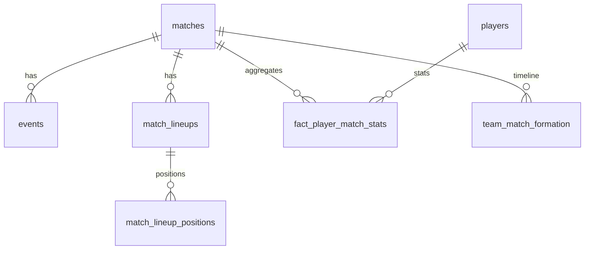

# Football Tactical Intelligence Platform — Agent Context

> Cursor 에이전트 **시스템 프롬프트**. 구현 전 필독. 불명확한 결정은 사용자에게 확인.  
> ERD 상세: `db/erd.dbml` | 데이터 검증: `scripts/validate_erd.py`

---

## 0. 변경 검증 (최우선)

**코드·스키마·ETL을 수정한 뒤 작업을 끝내기 전에 서브 에이전트 검증을 실행한다.**  
질문만 답했거나 문서만 수정한 경우는 제외.

Phase 1 목표는 `StatsBomb → staging → analytics` **파이프라인 증명**이다. 검증도 이에 맞춰 **두 종류만** 쓴다.

| 서브 에이전트 | 역할 | 언제 |
|---------------|------|------|
| **`bugbot`** | Python·SQL·ETL 로직 리뷰 (§5 집계 규칙, 멱등성, 회귀) | `.py`, `db/schema/*.sql`, `src/football/ingest/`, `src/football/aggregation/` 등 **코드 변경 시 항상** |
| **`shell`** | `scripts/validate_erd.py` + §8 검증 SQL | `db/erd.dbml`, DDL, ETL·집계·인제스트 **데이터 모델·적재 경로 변경 시** |

스키마·ETL을 건드리면 `bugbot` + `shell`을 **병렬** 실행한다. Python만 바꿨으면 `bugbot`만.

Phase 1 범위(웹 UI·인증·IAM 없음)이므로 `security-review`, `generalPurpose`는 **사용하지 않는다**. Phase 2 AWS/IAM 작업 시에만 보안 리뷰를 추가한다.

### 실행 순서

1. 구현·수정
2. 위 표에 따라 서브 에이전트 실행
3. 이슈 있으면 수정 후 **해당 검증 재실행**
4. 결과 보고 (리뷰 표 + 검증 기대값 vs 실측)

### 호출 (Task 도구)

diff는 서브 에이전트가 계산한다. 미커밋 변경 → `uncommitted changes`, 브랜치 전체 → `branch changes`.

**`bugbot`**

```text
subagent_type: bugbot
readonly: true
description: Bugbot

Full Repository Path: /Users/fairytale/dev/ws_cursor/football
Diff: uncommitted changes
Custom Instructions: AGENTS.md §5 ETL 규칙·Phase 1 범위 준수 확인
```

**`shell`** — 프로젝트 루트에서:

```text
subagent_type: shell
description: Validate ERD

.venv/bin/python scripts/validate_erd.py
# PostgreSQL 기동·적재·집계 후 §8 검증 SQL
# (matches 64, events 234637, players ~829, fact 1996, formation ~218)
```

### 사용자 요청

| 요청 | 동작 |
|------|------|
| "리뷰" / "버그 찾아줘" | `bugbot` |
| "검증" / "ERD 확인" | `shell` (`validate_erd.py` + §8 SQL) |
| "변경 확인" (스키마·ETL) | `bugbot` + `shell` 병렬 |

### 보고

- `bugbot`: Severity \| Location \| Finding 표. **지적만, 자동 수정 금지**
- `shell`: 통과/실패, 기대값 vs 실측 (예: events 234,637)

---

## 1. 프로젝트 정체성

**AI 기반 축구 전술 의사결정 플랫폼** (포트폴리오)

장기적으로는 **수집 → 저장/모델링 → 분석 → AI 추론**을 클라우드 위에서 end-to-end 구현하지만,  
**Phase 1에서 증명하는 것은 데이터 파이프라인 하나**다.

> **StatsBomb 원천에서 분석 가능한 형태까지, 어떻게 가공했는가**

```
StatsBomb Open Data (API)
    ↓  Python 정제·적재
staging (Silver) — events ~235k행, 원천 보존
    ↓  SQL ETL 집계
analytics (Gold) — fact ~2k행, 경기×선수 grain
    ↓  (Phase 5) SQL + RAG + LLM
분석·라인업 추천
```

| 역량 | Phase 1에서 보여줄 것 |
|------|----------------------|
| **DE** | StatsBomb API → PostgreSQL staging, 멱등 적재, `ingestion_runs` 추적 |
| **DA** | events → `fact_player_match_stats` 집계, **~119배 행 축소** (원천 vs 팩트) |
| **DA** | 인덱스 + `EXPLAIN ANALYZE` 전후 비교 (Step 4) |
| 클라우드 | Phase 2+ (S3, RDS, IAM) |
| AI | Phase 5 (SQL 선계산 후 LLM — 순수 LLM 추천 금지) |

### Phase 1 증명 목표 (평가자 데모)

**한 줄**: 터미널에서 파이프라인을 돌리고, psql에서 **원천 규모 vs 집계 결과**를 직접 보여준다.

**특히 강조**: WC2022 시드만이 아니라 **`competition_id` / `season_id`를 바꿔 다른 대회·시즌**에서도 동일 파이프라인으로 수집·집계가 되는지 보여주는 것.

#### 1단계 — 터미널 (`run_pipeline.py`)

평가자 앞에서 **한 명령**으로 staging 적재 → analytics 집계까지 실행. 경기별 진행 로그로 “실제로 API에서 받아 DB에 넣고 있다”는 것을 보여준다.

```bash
.venv/bin/python run_pipeline.py --competition-id 43 --season-id 106
```

기대 로그 (WC2022 64경기 예시):

```text
[1/64] match_id=3869685: 3842행 적재
[2/64] match_id=3869687: 4102행 적재
...
✓ events 적재 완료: 총 234,637행
✓ fact_player_match_stats ETL 완료
✓ team_match_formation ETL 완료
```

> `run_pipeline.py`는 `ingest` + `run_aggregation`을 감싼 **통합 진입점**.  
> 개발·디버그 시에는 `scripts/ingest_wc2022.py`, `scripts/run_aggregation.py`를 테이블·경기 단위로 사용.

#### 2단계 — psql (압축 증명)

파이프라인 직후, **원천이 얼마나 크고 집계 결과가 얼마나 압축됐는지** SQL로 확인.

```sql
-- "원천이 얼마나 크고, 집계 결과가 얼마나 압축됐는지" (시즌 scope — 다른 대회 적재 시에도 정확)
SELECT 'staging.events' AS table_name, COUNT(*) AS row_count
FROM staging.events e
INNER JOIN staging.matches m ON m.match_id = e.match_id
WHERE m.competition_id = 43 AND m.season_id = 106
UNION ALL
SELECT 'analytics.fact_player_match_stats', COUNT(*)
FROM analytics.fact_player_match_stats f
INNER JOIN staging.matches m ON m.match_id = f.match_id
WHERE m.competition_id = 43 AND m.season_id = 106;

-- WC2022 기대 결과:
-- staging.events                    | 234,637
-- analytics.fact_player_match_stats |   1,996
```

다른 대회 데모 시: `--competition-id` / `--season-id`만 바꿔 `run_pipeline.py` 재실행 → WHERE 절의 id를 맞추거나 `run_pipeline.py --counts-only`로 **해당 시즌의 축소율**을 즉시 보여준다.

### 분석·AI 데모 시나리오 (Phase 1 이후·WC2022 시드)
**다음 경기 상대 분석 → 우리 팀(South Korea) 라인업 추천**

- 우리 팀: **South Korea** (`team_id = 791`, WC 4경기)
- 분석 대상: **32개국 전체** (상대 전술 파악용)
- **검증·분석 시드**: **2022 FIFA 월드컵** (`competition_id=43`, `season_id=106`, 64경기)
- 데이터: **StatsBomb Open Data만**

---

## 2. staging vs analytics (OLAP 관점)

| | staging (Silver) | analytics (Gold) |
|---|------------------|------------------|
| 역할 | StatsBomb **원천** 보존 | **집계·분석** 진입점 |
| 규모 | events **~235k행** | fact **~2k행** |
| 쿼리 | ETL 입력용 (분석 직접 스캔 X) | SUM/GROUP BY, 라인업 추천 SQL |
| 정규화 | 3NF + events `payload JSONB` | 팩트 테이블 (사전 집계) |

**집계 목적**: 수십만 행 events → 경기×선수 팩트로 **~119배 축소** (WC2022 실측 234,637 → 1,996행).  
평가자 데모에서는 §1의 UNION COUNT 쿼리로 이 대비를 psql에서 직접 보여준다.

---

## 2.5 레포지토리 구조

Python **src layout** + **thin CLI scripts** + **SQL-as-code**. 설정·로직은 `src/football/` 패키지, 실행은 `scripts/`.

```
football/
├── run_pipeline.py                      # 통합 파이프라인 CLI (ingest → aggregate, 평가자 데모용)
├── pyproject.toml              # 패키지 메타·의존성 (pip install -e .)
├── requirements.txt            # venv 빠른 설치용
├── .env.example                # PG 접속 템플릿 → .env 복사
├── AGENTS.md
│
├── db/                         # 스키마 (코드와 분리)
│   ├── erd.dbml
│   └── schema/
│       ├── 00_schemas.sql
│       ├── 01_staging.sql
│       ├── 02_analytics.sql
│       └── 03_indexes.sql      # (예정)
│
├── src/football/               # import football.*
│   ├── config.py
│   ├── db/connection.py
│   ├── ingest/                 # StatsBomb → staging (transformers, loaders, statsbomb_client)
│   ├── aggregation/            # staging → analytics (SQL ETL)
│   └── pipeline/               # 통합 오케스트레이션 (ingest, aggregate, runner, reporting)
│
├── scripts/
│   ├── bootstrap.py
│   ├── init_db.py
│   ├── validate_erd.py         # ERD vs StatsBomb API (PG 불필요)
│   ├── run_pipeline.py         # 통합 CLI (scripts/ 경로)
│   ├── ingest_wc2022.py        # staging 적재 CLI (테이블·경기 단위)
│   ├── run_aggregation.py      # analytics 집계 CLI
│   └── analysis_wc2022.py      # 탐색·검증 SQL (8개 질문 + JSON 저장)
│
├── explore/
│   ├── statsbomb_wc2022.py     # PG 없이 StatsBomb 탐색
│   └── analysis_wc2022_results.json  # analysis_wc2022.py 결과 스냅샷
│
├── canvases/
│   └── wc2022-analysis-story.canvas.tsx  # Cursor Canvas 분석 스토리
│
└── docs/performance/           # (예정) EXPLAIN ANALYZE 캡처
```

### 레이어 역할

| 레이어 | 위치 | 역할 |
|--------|------|------|
| **설정** | `src/football/config.py` | `DB_CONFIG` dict, WC2022 시드 상수. env(`PGHOST` 등)로 override |
| **라이브러리** | `src/football/` | 재사용 로직 (DB, ingest, aggregation) |
| **CLI** | `scripts/` | argparse + 패키지 호출만 |
| **DDL** | `db/schema/` | PostgreSQL 스키마 (버전 관리) |
| **탐색** | `explore/`, `scripts/analysis_wc2022.py`, `canvases/` | API 탐색·SQL 분석·데모 스토리 |

### 설정 (`config.py`)

```python
DB_CONFIG = {"host": ..., "port": 5432, "dbname": "football", ...}
COMPETITION_ID = 43
SEASON_ID = 106
```

- 기본 DB명: **`football`** (`.env`의 `PGDATABASE`로 override)
- 비밀번호: `.env` / `PGPASSWORD` (`.env.example` 참고)
- import: `from football.config import DB_CONFIG, COMPETITION_ID`

### 로컬 실행

```bash
python -m venv .venv && .venv/bin/pip install -e .
cp .env.example .env   # 비밀번호 입력
.venv/bin/python scripts/init_db.py

# Phase 1 파이프라인 — 평가자 데모 (한 번에)
.venv/bin/python run_pipeline.py --competition-id 43 --season-id 106

# 개발·디버그 (순서대로, 테이블·경기 단위)
.venv/bin/python scripts/ingest_wc2022.py --table all      # staging (~2min, events API)
.venv/bin/python scripts/run_aggregation.py --table all    # analytics (~1s)

# 검증·탐색
.venv/bin/python scripts/ingest_wc2022.py --counts-only
.venv/bin/python scripts/run_aggregation.py --counts-only
.venv/bin/python scripts/analysis_wc2022.py              # 8개 분석 SQL + JSON
.venv/bin/python explore/statsbomb_wc2022.py               # PG 없이 API 탐색
```

테이블별 점진 테스트: `ingest_wc2022.py --table competitions|…|events|lineups`, `--match-id`로 단일 경기.  
집계: `run_aggregation.py --table formation|fact|all`, `--match-id`로 단일 경기.

### 제거한 설계 (검증 후 확정)
| 제거 | 이유 |
|------|------|
| `oltp.*` | WC는 국가대회. 신체·시장가치 StatsBomb에 없음 → 합성 데이터는 약점 |
| `analytics.dim_*` | 팩트 ~2k행에 dim 4개는 과설계. `staging JOIN`으로 충분 |
| `dim_formation` FK | Tactical Shift 243건 — 팩트 FK로 시점 모호 → `team_match_formation` 타임라인으로 대체 |

---

## 3. 현재 단계 (Phase 1)

### 완료
- `explore/statsbomb_wc2022.py`, Python venv, statsbombpy
- ERD 설계·단순화 (`db/erd.dbml`, 11테이블)
- **실데이터 검증** (`scripts/validate_erd.py`) — WC2022 64경기 전수
- PostgreSQL DDL (`db/schema/*.sql`) + 스키마 적용 (`scripts/init_db.py`)
- **레포 구조** (`src/football/` 패키지, `config.py`, `pyproject.toml`) — §2.5
- **staging 적재** (`scripts/ingest_wc2022.py` + `src/football/ingest/`) — 테이블별 로더, `ingestion_runs` 추적
- **analytics 집계** (`scripts/run_aggregation.py` + `src/football/aggregation/`) — SQL ETL, §8 검증 통과
- **탐색·분석** (`scripts/analysis_wc2022.py`, `canvases/wc2022-analysis-story.canvas.tsx`)

### 실측 규모 (적재·집계 후)
| 항목 | 값 |
|------|-----|
| 경기 | 64 |
| 팀 | 32 |
| players | 829 |
| events | 234,637 (경기당 ~3,666) |
| match_lineups | 3,244 |
| fact_player_match_stats | 1,996 |
| team_match_formation | 218 (Starting XI/Tactical Shift 371건 → 타임라인 dedup) |
| formation 이벤트 (staging) | 371 (Starting XI 128 + Tactical Shift 243) |
| 한국 fact 행 | 60 (`team_id=791`) |
| 한국 경기 | 4 (`3857287`, `3857299`, `3857262`, `3869253`) |

### 지금 할 일
1. ~~DB 연결~~ ✅
2. ~~WC2022 staging 적재~~ ✅
3. ~~analytics 집계 ETL~~ ✅
4. ~~**`run_pipeline.py` 통합 CLI**~~ ✅ — `--competition-id` / `--season-id`, 경기별 로그, ingest → aggregate
5. **인덱스 + `EXPLAIN ANALYZE` 캡처** (`db/schema/03_indexes.sql`, `docs/performance/`) — §3.1 Step 5 — **다음 작업**
6. (Phase 5) AI 라인업 — SQL 컨텍스트 + RAG

### 3.1 파이프라인 작업계획 (StatsBomb → staging → analytics)

```
statsbombpy (Open Data API)
    ↓
Python 정제 (타입 변환, NULL 처리, UUID·컬럼 매핑)
    ↓
PostgreSQL staging (8테이블)
    ↓
ETL 집계 (§5 규칙)
    ↓
PostgreSQL analytics (fact_player_match_stats, team_match_formation)
```

**검증 시드**: `competition_id=43`, `season_id=106` (WC2022 64경기) — §8 카운트 기준  
**데모 요구**: 동일 파이프라인이 **다른 `(competition_id, season_id)`** 에서도 동작 (StatsBomb Open Data 내 임의 대회)  
**검증 기준**: §8 검증 SQL (matches 64, events ~234,637, fact ~1,996)

#### 디렉터리·스크립트 구조

| 경로 | 역할 | 상태 |
|------|------|------|
| `scripts/init_db.py` | DDL 적용·DB 생성·테이블 검증 | ✅ |
| `src/football/config.py` | `DB_CONFIG`, `COMPETITION_ID`, `SEASON_ID`, `KOREA_TEAM_ID` | ✅ |
| `src/football/db/connection.py` | `get_connection()`, `transaction()` | ✅ |
| `scripts/ingest_wc2022.py` | statsbombpy → staging CLI (`--table`, `--match-id`) | ✅ |
| `src/football/ingest/transformers.py` | API row → DB row 정제 | ✅ |
| `src/football/ingest/loaders.py` | 테이블별 UPSERT / DELETE+INSERT | ✅ |
| `src/football/ingest/statsbomb_client.py` | statsbombpy fetch 래퍼 | ✅ |
| `src/football/aggregation/fact_player_match_stats.py` | events + lineups → fact (SQL) | ✅ |
| `src/football/aggregation/team_match_formation.py` | 포메이션 타임라인 (SQL) | ✅ |
| `src/football/aggregation/common.py` | match scope, 테이블별 DELETE | ✅ |
| `scripts/run_aggregation.py` | analytics 집계 CLI (`--table formation\|fact\|all`) | ✅ |
| `scripts/analysis_wc2022.py` | WC2022 탐색 SQL 8종 + JSON | ✅ |
| `run_pipeline.py` | 통합 파이프라인 CLI (`--competition-id`, `--season-id`, 경기별 로그) | ✅ |
| `db/schema/03_indexes.sql` | §6 인덱스 | 🔲 |
| `docs/performance/` | EXPLAIN ANALYZE 캡처 | 🔲 |

환경 변수: `PGHOST`, `PGPORT`, `PGDATABASE`, `PGUSER`, `PGPASSWORD` (`.env.example` 참고).

#### Step 1 — DB 연결 (`src/football/config.py`, `db/connection.py`) ✅

- `DB_CONFIG` dict + `db_config(dbname?)` 헬퍼
- `connection.py`: `psycopg2.connect(**db_config())`, `transaction()` 컨텍스트 매니저
- WC2022 상수: `COMPETITION_ID`, `SEASON_ID`, `KOREA_TEAM_ID` — ingest·validate 공통

#### Step 2 — staging 적재 (`scripts/ingest_wc2022.py`)

**실행 순서** (FK 의존):

```
competitions → seasons → teams → players → matches
  → (경기별) events, match_lineups, match_lineup_positions
```

**statsbombpy 호출**

| 대상 | API |
|------|-----|
| 대회·시즌 | `sb.competitions()` |
| 경기 | `sb.matches(competition_id, season_id)` |
| 이벤트 | `sb.events(match_id)` |
| 라인업 | `sb.lineups(match_id)` |

**Python 정제 규칙** (`validate_erd.py`·ERD 기준)

| 원천 | 변환 |
|------|------|
| `events.id` | `event_id` UUID (그대로) |
| `events.location` `[x,y]` | `location_x`, `location_y` |
| `pass_outcome` / `shot_outcome` | `outcome` 통합 |
| `shot_statsbomb_xg` | 컬럼 유지 |
| 나머지 sparse 컬럼 | `payload` JSONB (`duel_type`, `pass_goal_assist`, `tactics` 등) |
| `matches.stadium` / `referee` | `stadium_name` / `referee_name` |
| `lineups.country` | `players.country_name` |
| `positions[].from` / `to` (`'64:10'`) | `from_minute` / `to_minute` 정수 파싱 |
| NaN / 빈 문자열 | `NULL` |
| pandas 타입 | Python native → psycopg2 호환 |

**멱등·추적**

- **`staging.ingestion_runs`**: 배치 실행 이력 (`running` → `success`/`failed`). 재적재·실패 추적·Phase 2 오케스트레이션 대비. pipeline 실패 시 run 기록은 **별도 transaction**으로 커밋.
- 적재 시작·종료 시 `ingestion_runs` 기록 (`--no-run-log`로 생략 가능)
- **전체 시즌** 재실행: `load_matches`가 해당 `(competition_id, season_id)` 경기·자식(events/lineups) DELETE 후 INSERT
- **`--match-id`**: 지정 경기만 DELETE+INSERT; 존재하지 않는 ID는 `ValueError` (silent delete 방지)
- `events`/`lineups` 적재는 해당 match_id만 삭제 (상대 테이블 건드리지 않음)
- `ingested_at = now()` on master rows

**완료 기준**: §8 SQL — `staging.matches` 64, `staging.events` 234,637, `staging.players` ~829

#### Step 3 — analytics 집계 (`src/football/aggregation/` + `scripts/run_aggregation.py`) ✅

**입력**: staging `events`, `match_lineups`, `match_lineup_positions`, `matches`  
**출력**: `analytics.fact_player_match_stats`, `analytics.team_match_formation`  
**구현**: Python 모듈에 **SQL CTE** (`FACT_INSERT_SQL`, `FORMATION_INSERT_SQL`) — 집계 로직은 DB에서 실행

| 모듈 | grain | 핵심 로직 |
|------|-------|-----------|
| `fact_player_match_stats.py` | `(match_id, player_id)` — **events에 player_id 있는 행만** | events GROUP BY + minutes from lineup_positions |
| `team_match_formation.py` | `(match_id, team_id, from_minute)` | Starting XI / Tactical Shift, `to_minute` = LEAD(from_minute) |

**멱등**

- `--table formation` / `fact` 각각 **해당 analytics 테이블만** match_id 범위 DELETE 후 INSERT
- `--table all`: formation → fact 순서 (FK 없음, formation 먼저)
- `aggregated_at = now()`

**완료 기준**: §8 SQL — fact 1,996, formation ~218, Korea fact 60, match `3869253` formation 타임라인

#### Step 4 — `run_pipeline.py` 통합 CLI (평가자 데모)

- **목적**: §1 데모 — 한 명령으로 ingest → aggregate, 경기별 `[n/N] match_id=…: …행 적재` 로그
- **인자**: `--competition-id`, `--season-id` (필수). WC2022 기본값은 config 상수, **다른 대회 데모 시 CLI로 override**
- **흐름**: master 테이블(competitions → … → matches) → 경기별 events/lineups → formation → fact
- **완료 로그**: `✓ events 적재 완료: 총 N행`, `✓ fact_player_match_stats ETL 완료` 등
- 기존 `ingest_wc2022.py` / `run_aggregation.py` 로직 재사용 (thin wrapper)

#### Step 5 — 인덱스·성능 (DDL 이후)

- `db/schema/03_indexes.sql` (§6)
- `docs/performance/` EXPLAIN ANALYZE 전후

#### 구현 순서 (에이전트 체크리스트)

```
[✅] init_db.py + db/schema/*.sql
[✅] src/football/config.py + db/connection.py + pyproject.toml
[✅] src/football/ingest/ + scripts/ingest_wc2022.py  → §8 staging 카운트
[✅] src/football/aggregation/ + scripts/run_aggregation.py → §8 analytics 카운트
[✅] scripts/analysis_wc2022.py + canvases/wc2022-analysis-story.canvas.tsx
[✅] run_pipeline.py — competition/season 파라미터, 경기별 로그, 통합 실행
[ ] db/schema/03_indexes.sql + docs/performance/
```

코드 변경 시 §0: staging·ETL 동시 수정이면 `bugbot` + `shell` 병렬.

### 이후 (Phase 2+)
| Phase | 내용 |
|-------|------|
| 2 | S3 bronze, Airflow/MWAA 또는 EventBridge+Lambda |
| 3 | AWS RDS PostgreSQL + pgvector |
| 4 | EC2 PG → RDS 비교 문서 |
| 5 | AI 라인업 (SQL + RAG + LLM) |

### 범위 제외
- 계약·부상·훈련, StatsBomb 외 소스, 웹 UI, 유료 API

---

## 4. 데이터 모델 (11테이블)

> 전체 ERD: `db/erd.dbml`

### staging (8)
| 테이블 | 역할 |
|--------|------|
| `competitions`, `seasons` | 대회·시즌. seasons PK = `(competition_id, season_id)` 복합 |
| `teams`, `players` | 32팀, 829선수 (lineups에서 upsert) |
| `matches` | 64경기 메타. `stadium`→`stadium_name`, `referee`→`referee_name` |
| `events` | **~235k raw**. 공통 컬럼 + `payload JSONB` |
| `match_lineups` | 경기 스쿼드·선발 여부 |
| `match_lineup_positions` | 포지션·교체 **시간 구간** → minutes 집계 |
| `ingestion_runs` | 배치 멱등·재처리 추적 |

### analytics (3)
| 테이블 | 역할 |
|--------|------|
| **`fact_player_match_stats`** ★ | grain: `(match_id, player_id)`. 분석·SQL 컨텍스트 진입점 |
| **`team_match_formation`** | `(match_id, team_id, from_minute)` 포메이션 타임라인 |
| `embedding_documents` | RAG 벡터 (Phase 5) |

### ER (핵심)



### fact_player_match_stats 컬럼
출전(minutes, is_starter, position) · 패스 · 슈팅(xG, goals, assists) · 수비(pressures, interceptions, blocks) · dribbles · cards

FK는 **staging 원천 ID 직접 참조** (dim 없음).

---

## 5. ETL 규칙 (실데이터 검증·구현 반영)

> staging 적재 시 `pass_outcome`/`shot_outcome` → **`staging.events.outcome`** 통합.  
> sparse 필드(`duel_type`, `pass_goal_assist`, `tactics` 등) → **`payload` JSONB**.

### events → fact 집계
| fact 컬럼 | 집계 규칙 (staging 기준) |
|-----------|-----------|
| **grain** | `events.player_id IS NOT NULL` DISTINCT `(match_id, player_id)` — **1,996행** |
| `passes_attempted` | `type = 'Pass'` COUNT |
| `passes_completed` | Pass 중 **`outcome IS NULL`** (= StatsBomb `pass_outcome` NULL) |
| `shots` / `goals` | `type = 'Shot'` / **`outcome = 'Goal'`** |
| `shots_on_target` | Shot 중 **`outcome IN ('Saved', 'Goal')`** |
| `pressures` | `type = 'Pressure'` |
| `tackles` | `type = 'Duel' AND payload->>'duel_type' = 'Tackle'` |
| `interceptions` / `blocks` / `carries` | 해당 type COUNT |
| `dribbles_attempted` / `dribbles_completed` | `Dribble` COUNT / Dribble 중 `outcome IS NULL` |
| `assists` | Pass 중 **`payload->>'pass_goal_assist' IS NOT NULL`** |
| `xg` | Shot의 `shot_statsbomb_xg` SUM |
| `xa` | StatsBomb xA 컬럼 없음 → **0 고정** (스키마 placeholder) |
| `yellow_cards` | `Foul Committed`/`Bad Behaviour`의 `payload` card = `'Yellow Card'` |
| `red_cards` | card IN (`'Red Card'`, `'Second Yellow'`) |
| `minutes_played` | `match_lineup_positions` 구간 합; **`to_minute` NULL** → 해당 경기 `MAX(events.minute)`까지 |
| `is_starter` / `position_played` | `match_lineups.is_starter`; 최장 구간 `position_name` |
| `progressive_passes` | 전용 컬럼 없음 → **NULL** |
| `pass_completion_rate` | `passes_completed / passes_attempted` (attempted > 0) |

### staging.events — 압박·패스 분석 시 주의
- `under_pressure`: StatsBomb은 **`TRUE`만 명시** — `NULL` = 압박 없음 (`FALSE` 거의 없음)
- 압박 하 패스 성공률 ~70.8% vs 무압박 ~83.7% (WC2022 전체)

### match_lineup_positions
- StatsBomb `positions[]`의 `from`/`to`는 `'64:10'` 문자열 → **`from_minute`/`to_minute` = 콜론 앞 정수**
- `from_period`, `to_period`, `start_reason`, `end_reason` 그대로 보존

### team_match_formation
- `Starting XI` / `Tactical Shift` — `payload.tactics.formation`
- `index` 순 정렬; **연속 동일 formation** 변경은 스킵
- **동일 `from_minute` 복수 Shift** → `DISTINCT ON (match_id, team_id, from_minute) … ORDER BY index DESC` (마지막 formation 유지)
- `to_minute` = `LEAD(from_minute)` (마지막 구간 NULL)

**실例 (한국 vs 브라질, 3869253)**:
```
Korea  0' 442 → 45' 4141
Brazil 0' 4231 → 80' 4411
```
(검증: `SELECT * FROM analytics.team_match_formation WHERE match_id=3869253 ORDER BY team_id, from_minute`)

---

## 6. 인덱스

```sql
-- 팩트 (분석 쿼리)
CREATE INDEX idx_fpms_player_match ON analytics.fact_player_match_stats (player_id, match_id);
CREATE INDEX idx_fpms_team_match   ON analytics.fact_player_match_stats (team_id, match_id);
-- 커버링
CREATE INDEX idx_fpms_cover ON analytics.fact_player_match_stats (player_id, match_id)
  INCLUDE (xg, passes_attempted, passes_completed, pass_completion_rate, minutes_played);

-- ETL (이벤트 집계)
CREATE INDEX idx_events_match_type_player ON staging.events (match_id, type, player_id);

-- 포메이션 타임라인
CREATE INDEX idx_tmf_timeline ON analytics.team_match_formation (match_id, team_id, from_minute);
```

`EXPLAIN (ANALYZE, BUFFERS)` 전후 → `docs/performance/`

---

## 7. 파이프라인 · AWS · AI

### Phase 1
```
statsbombpy → staging.* (ingest / run_pipeline.py)
           → analytics.fact_player_match_stats + team_match_formation (aggregate / run_pipeline.py)
           → psql UNION COUNT (원천 vs 팩트 압축 증명)
           → analysis_wc2022.py / Canvas (탐색·스토리)
```

**평가자 경로**: `run_pipeline.py` → psql §1 UNION 쿼리. **다른 대회**: `--competition-id` / `--season-id` 변경 후 동일 절차.

### Phase 2+ AWS
RDS(PostgreSQL+pgvector) + S3 bronze + Lambda/EC2 + IAM/VPC/SG. EC2 PG → RDS 비교 문서.

### AI (Phase 5)
```
[질의] "브라질전 라인업"
  ① SQL — fact + team_match_formation + staging JOIN
  ② pgvector — embedding_documents 유사 사례
  ③ LLM — ①② 컨텍스트로 추천 + 근거
```
금지: SQL 없이 LLM만 / 근거 없는 AI UI.

---

## 8. 에이전트 지침

> **§0 변경 검증이 모든 지침보다 우선한다.** 파일을 수정했다면 Phase 작업보다 먼저 서브 에이전트 검증을 실행한다.

### Phase 1 우선순위
1. ~~`db/schema/*.sql` + `scripts/init_db.py`~~ ✅
2. ~~`src/football/config.py` + `db/connection.py`~~ ✅
3. ~~`scripts/ingest_wc2022.py` + `src/football/ingest/`~~ ✅
4. ~~`src/football/aggregation/` + `scripts/run_aggregation.py`~~ ✅
5. ~~**`run_pipeline.py`** — 통합 CLI, `--competition-id`/`--season-id`, 경기별 로그 (§1 평가자 데모)~~ ✅
6. **`db/schema/03_indexes.sql` + `docs/performance/`** EXPLAIN 캡처 — **다음 작업**
7. (Phase 5) AI 라인업 — SQL + RAG + LLM

### 하지 말 것
- `oltp`, `dim_*` 테이블 재도입
- `staging.events` 94컬럼 wide table
- 합성 선수 데이터
- StatsBomb 외 소스
- AI를 ETL·스키마 없이 선행

### 검증 SQL
```sql
-- §1 평가자 데모: 원천 vs 집계 압축 (시즌 scope)
SELECT 'staging.events' AS table_name, COUNT(*) AS row_count
FROM staging.events e
INNER JOIN staging.matches m ON m.match_id = e.match_id
WHERE m.competition_id = 43 AND m.season_id = 106
UNION ALL
SELECT 'analytics.fact_player_match_stats', COUNT(*)
FROM analytics.fact_player_match_stats f
INNER JOIN staging.matches m ON m.match_id = f.match_id
WHERE m.competition_id = 43 AND m.season_id = 106;
-- WC2022: 234,637 | 1,996 (~118배 축소)
-- 또는: .venv/bin/python run_pipeline.py --counts-only

-- staging (WC2022 시드)
SELECT COUNT(*) FROM staging.matches
WHERE competition_id = 43 AND season_id = 106;  -- 64

SELECT COUNT(*) FROM staging.events;             -- 234,637

SELECT COUNT(*) FROM staging.players;            -- 829

-- analytics
SELECT COUNT(*) FROM analytics.fact_player_match_stats;  -- 1,996

SELECT COUNT(*) FROM analytics.team_match_formation;     -- 218

SELECT COUNT(*) FROM analytics.fact_player_match_stats
WHERE team_id = 791;  -- 60 (한국 선수-경기 fact)

SELECT team_id, from_minute, to_minute, formation_code, source_event_type
FROM analytics.team_match_formation
WHERE match_id = 3869253 ORDER BY team_id, from_minute;
-- 791: 0→45 442, 45→NULL 4141 | 781: 0→80 4231, 80→NULL 4411
```

탐색·스토리 검증: `.venv/bin/python scripts/analysis_wc2022.py` → `explore/analysis_wc2022_results.json`

---

## 9. 결정 로그

| 날짜 | 결정 |
|------|------|
| 2026-06-14 | 시드 = 2022 WC, StatsBomb only, 우리 팀 = Korea (791) |
| 2026-06-14 | ERD 17→11테이블. oltp·dim_* 제거, team_match_formation 도입 |
| 2026-06-14 | 실데이터 검증 통과 (validate_erd.py) |
| 2026-06-14 | tackles = Duel+Tackle, passes_completed = outcome IS NULL |
| 2026-06-14 | RDS + pgvector, SQL+RAG+LLM 하이브리드 |
| 2026-06-14 | §0 추가: 변경 후 서브 에이전트 검증·리뷰 최우선 |
| 2026-06-14 | §0 축소: Phase 1은 `bugbot` + `shell`만 (security/generalPurpose 제외) |
| 2026-06-14 | §3.1 추가: StatsBomb→staging→analytics 파이프라인 작업계획 (DB 연결·적재·집계) |
| 2026-06-14 | 레포 구조 재설계: `src/football/` 패키지, `DB_CONFIG` dict config, `explore/` 분리 |
| 2026-06-14 | DB명 `football` 단일 사용 (PG `PGDATABASE=football`) |
| 2026-06-14 | staging ingest: 테이블별 `load_*`, `--table`/`--match-id` CLI, `ingestion_runs` 별도 transaction |
| 2026-06-14 | analytics 집계: SQL CTE in Python, fact grain = events with player_id, minutes NULL→match max minute |
| 2026-06-14 | formation dedup: consecutive same code skip; same-minute → highest index |
| 2026-06-14 | `scripts/analysis_wc2022.py` + Canvas 분석 스토리 (DA 데모용) |
| 2026-06-14 | `run_pipeline.py` 구현: 통합 CLI, 경기별 events 로그, 시즌 scope 압축 요약 |

---

## 참고

- `run_pipeline.py` — 통합 파이프라인 CLI (평가자 데모, `--competition-id` / `--season-id`)
- `explore/statsbomb_wc2022.py` — StatsBomb 탐색 (PG 불필요)
- `scripts/ingest_wc2022.py` — staging 적재 CLI (개발·디버그)
- `scripts/run_aggregation.py` — analytics 집계 CLI
- `scripts/analysis_wc2022.py` — WC2022 탐색 SQL 8종
- `canvases/wc2022-analysis-story.canvas.tsx` — 분석 스토리 Canvas
- `src/football/config.py` — DB·WC2022 설정
- `db/erd.dbml` — ERD (dbdiagram.io)
- `scripts/validate_erd.py` — ERD 실데이터 검증 (API, PG 불필요)
- StatsBomb: https://github.com/statsbomb/open-data
- 한국 16강: `match_id = 3869253` (vs Brazil)
- 2022 결승: `match_id = 3869685`
