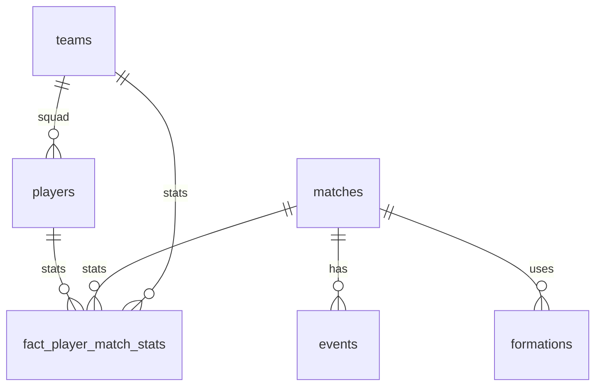

# Football Tactical Intelligence Platform — Agent Context

> Cursor 에이전트 **시스템 프롬프트**. 구현 전 필독. 불명확한 결정은 사용자에게 확인.

---

## 1. 프로젝트 정체성

**AI 기반 축구 클럽 선수 관리 및 전술 의사결정 플랫폼** (포트폴리오)

어필 포인트: 단순 CRUD가 아니라 **데이터 수집 → 저장/모델링 → 분석 → AI 추론**을 클라우드 위에서 end-to-end로 구현.

```
수집 → S3(raw) → staging(silver) → analytics(gold/RDS) → 분석 → AI(RAG)
```

| 역량 | 어필 |
|------|------|
| DA | OLTP/OLAP 분리, 스타 스키마, `PlayerMatchStats` 팩트, 인덱스 + `EXPLAIN ANALYZE` 전후 비교 |
| DE | 메달리온, 멱등·증분 적재, 실패 재처리 |
| 클라우드 | EC2 PG 직접 운영 → RDS 마이그레이션 비교, IAM/VPC/SG |
| AI | RAG + pgvector, **SQL 통계 선계산 후 LLM** (순수 LLM 추천 금지) |

### 데모 시나리오 (이것만)
**다음 경기 상대 분석 → 우리 팀(South Korea) 라인업 추천**

- 우리 클럽: **South Korea** (`statsbomb_team_id = 791`)
- 시드 데이터: **2022 FIFA 월드컵** (`competition_id=43`, `season_id=106`, 64경기)
- 데이터 소스: **StatsBomb Open Data만** (다른 API·스크래핑 사용 안 함)

---

## 2. OLTP vs OLAP (이 프로젝트에서의 의미)

### OLTP (Online Transaction Processing)
**일상 업무용 DB** — 한 건씩 빠르게 읽고 쓰는 패턴.

- 예: 선수 정보 수정, 스쿼드 등록
- 특징: 정규화(중복 최소화), 무결성, 행 단위 갱신
- 이 프로젝트: `oltp` 스키마 — **우리 클럽 선수 마스터** (신체·포지션·시장가치 등)

### OLAP (Online Analytical Processing)
**분석용 DB** — 많은 데이터를 모아 통계·집계·비교하는 패턴.

- 예: "상대팀 측면 패스 비율", "우리 선수 WC 전체 xG"
- 특징: 스타 스키마(fact + dimension), 사전 집계, 대량 스캔
- 이 프로젝트: `analytics` 스키마 — **`fact_player_match_stats`가 핵심**

### 왜 나누나 (포트폴리오 서술)
| | OLTP | OLAP |
|---|------|------|
| 목적 | 클럽 운영·마스터 | 전술 분석·AI 컨텍스트 |
| 정규화 | 3NF | 팩트 테이블(분석 친화) |
| 쿼리 | PK 단건 조회 | SUM/AVG/GROUP BY |

`staging`은 StatsBomb **원천 적재(silver)** — OLAP 집계의 재료.

---

## 3. 현재 단계 (Phase 1)

### 완료
- `explore_statsbomb.py`, Python venv, statsbombpy

### 지금 할 일
1. 데이터 모델 확정 → 로컬 PostgreSQL DDL (`oltp`, `staging`, `analytics`)
2. 2022 WC 64경기 StatsBomb 인제스트 → `staging`
3. `analytics.fact_player_match_stats` 집계
4. 인덱스 + `EXPLAIN ANALYZE` 캡처 (`docs/performance/`)

### 이후 (Phase 2+)
| Phase | 내용 |
|-------|------|
| 2 | S3 raw, Airflow/MWAA(또는 EventBridge+Lambda), 멱등 배치 |
| 3 | AWS RDS PostgreSQL + **pgvector** |
| 4 | EC2 PG → RDS 마이그레이션 비교 문서 |
| 5 | AI 라인업 추천 (SQL + RAG + LLM) |

### 범위 제외
- 계약·부상·훈련 데이터
- Football-Data.org, FBref, Kaggle 등 **StatsBomb 외 소스**
- 웹 UI, 인증, 실시간 스트리밍, StatsBomb 유료 API

---

## 4. 데이터 모델

### 스키마 구성
```
oltp       — 우리 클럽 선수 마스터 (정규화, OLTP)
staging    — StatsBomb 원천 (이벤트·경기, silver)
analytics  — 분석 팩트·차원 (스타 스키마, OLAP)
```

### ER (핵심만)



### 핵심 엔터티

#### Team (`oltp.teams` + `staging.teams`)
- StatsBomb 팀 ID, 팀명, 국가
- 우리 클럽: South Korea (`791`)

#### Player (`oltp.players` + `staging.players`)
| 필드 | 비고 |
|------|------|
| 신체정보 | height_cm, weight_kg, preferred_foot |
| 포지션 | primary_position, secondary_positions |
| 시장가치 | market_value_eur |
| 매핑 | `statsbomb_player_id`로 WC 데이터 연결 |

> 계약·부상·훈련 테이블은 **만들지 않음**.

#### Match (`staging.matches`)
- 상대팀, 일자, 홈/어웨이, 대회, 스테이지, 스코어
- PK: `match_id` (StatsBomb)

#### Formation (`analytics.dim_formation`)
- 경기·팀별 포메이션 (`433`, `4231` …)
- `Starting XI` / `Tactical Shift` 이벤트에서 ETL

#### PlayerMatchStats (`analytics.fact_player_match_stats`) ★ 핵심 팩트
**Grain**: `(match_id, player_id)` — 경기별 선수 1행

| 그룹 | 컬럼 |
|------|------|
| 출전 | minutes_played, is_starter, position_played |
| 패스 | passes_attempted, passes_completed, pass_completion_rate |
| 슈팅 | shots, shots_on_target, goals, assists, xg, xa |
| 수비 | tackles, interceptions, pressures, blocks |
| 기타 | dribbles, carries, yellow_cards, red_cards |

집계 원천: `staging.events` + `staging.match_lineups`

#### staging.events
- 공통 컬럼 + `payload JSONB` (94컬럼 wide table 금지)
- PK: `event_id` (UUID)

### statsbombpy → DB
| API | 테이블 |
|-----|--------|
| `competitions()` | `staging.competitions`, `staging.seasons` |
| `matches(43, 106)` | `staging.matches` + teams |
| `events(match_id)` | `staging.events` |
| `lineups(match_id)` | `staging.match_lineups` |
| 집계 ETL | `analytics.fact_player_match_stats`, `dim_formation` |

---

## 5. 인덱스 설계

**원칙**: 쿼리 패턴 먼저 정의 → 복합·커버링 인덱스 → `EXPLAIN (ANALYZE, BUFFERS)` 전후 캡처.

```sql
-- 팩트: 경기별·선수별 (핵심)
CREATE INDEX idx_fpms_match_player
  ON analytics.fact_player_match_stats (match_id, player_id);

CREATE INDEX idx_fpms_player_match
  ON analytics.fact_player_match_stats (player_id, match_id);

-- 커버링: 선수 대시보드
CREATE INDEX idx_fpms_player_covering
  ON analytics.fact_player_match_stats (player_id, match_id)
  INCLUDE (xg, passes_completed, passes_attempted, pass_completion_rate, minutes_played);

-- ETL·이벤트 집계
CREATE INDEX idx_events_match_type_player
  ON staging.events (match_id, type, player_id);
```

**EXPLAIN 대상 쿼리 예시**:
```sql
-- 우리 선수 WC 누적 xG·패스율 (라인업 추천 SQL 컨텍스트)
SELECT SUM(xg), SUM(passes_completed)::float / NULLIF(SUM(passes_attempted), 0)
FROM analytics.fact_player_match_stats fpms
JOIN staging.players p ON fpms.player_id = p.player_id
WHERE fpms.team_id = 791;

-- 상대팀 경기별 압박 합계
SELECT team_id, SUM(pressures), SUM(tackles)
FROM analytics.fact_player_match_stats
WHERE match_id = :opponent_match_id
GROUP BY team_id;
```

---

## 6. 파이프라인

### Phase 1 (로컬)
```
statsbombpy → staging.* → analytics.fact_player_match_stats
```

### Phase 2+ (AWS)
```
StatsBomb → Lambda/EventBridge → S3(bronze) → Airflow/MWAA → RDS(staging+analytics)
```

**운영 (문서화)**:
- **멱등성**: natural key UPSERT
- **증분**: `ingestion_watermarks`로 변경분만
- **재처리**: 경기 단위 트랜잭션, 실패 match_id만 재실행
- **계보**: `data_source`, `ingested_at`

---

## 7. AWS (목표)

| 서비스 | 용도 |
|--------|------|
| RDS PostgreSQL + pgvector | staging + analytics + oltp |
| S3 | bronze raw JSON |
| Lambda / EC2 | 수집·API |
| IAM, VPC, SG | 최소 권한·네트워크 격리 |

**포트폴리오 스토리**: EC2에 PG 직접 설치(운영 체감) → RDS 마이그레이션 → `docs/aws/ec2-vs-rds.md` 비교.

---

## 8. AI 라인업 추천 (RAG + Vector)

### 왜 RAG
라인업은 과거 유사 전술·현재 선수 스탯을 종합해야 함. LLM 단독은 환각 위험 → **SQL + RAG + LLM** 하이브리드.

```
[질의] "브라질전 라인업 추천"
  ├─① SQL: 상대 약점 포지션, 우리 선수 매치업 우위 (fact_player_match_stats)
  ├─② pgvector: 유사 전술 경기·대응 라인업·결과 검색
  └─③ LLM: ①② 컨텍스트로 추천 + 근거 생성
```

### `analytics.embedding_documents`
- `doc_type`: match_report, tactical_pattern, player_profile
- `content` + `embedding vector(1536)` + `metadata JSONB`
- Phase 5에서 ivfflat 인덱스

### 금지
- SQL 없이 LLM만으로 추천
- 근거 없는 "AI 추천" UI

---

## 9. 에이전트 지침

### Phase 1 우선순위
1. `db/schema/*.sql`
2. `scripts/init_db.py` + `ingest_wc2022.py`
3. `src/aggregation/player_match_stats.py`
4. `docs/performance/` EXPLAIN 캡처

### 하지 말 것
- OLTP·OLAP 한 테이블에 혼합
- StatsBomb 외 소스 연동
- 계약/부상/훈련 테이블 생성
- AI를 스키마·SQL 없이 먼저 구현

### 검증
```sql
SELECT COUNT(*) FROM staging.matches
WHERE competition_id = 43 AND season_id = 106;  -- 64

SELECT COUNT(*) FROM analytics.fact_player_match_stats
WHERE team_id = 791;  -- 한국 선수 경기별 스탯
```

---

## 10. 결정 로그

| 날짜 | 결정 |
|------|------|
| 2026-06-14 | 시드 = 2022 WC, StatsBomb only |
| 2026-06-14 | 우리 클럽 = South Korea (791) |
| 2026-06-14 | 데모 = 상대 분석 + 라인업 추천만 |
| 2026-06-14 | 계약·부상·훈련 제외 |
| 2026-06-14 | `fact_player_match_stats` = 핵심 OLAP 팩트 |
| 2026-06-14 | RDS + pgvector 단일 인스턴스 |

---

## 참고

- `explore_statsbomb.py` — 데이터 탐색
- StatsBomb: https://github.com/statsbomb/open-data
- 2022 결승: `match_id = 3869685`
- 한국 16강: `match_id = 3869253` (vs Brazil)
